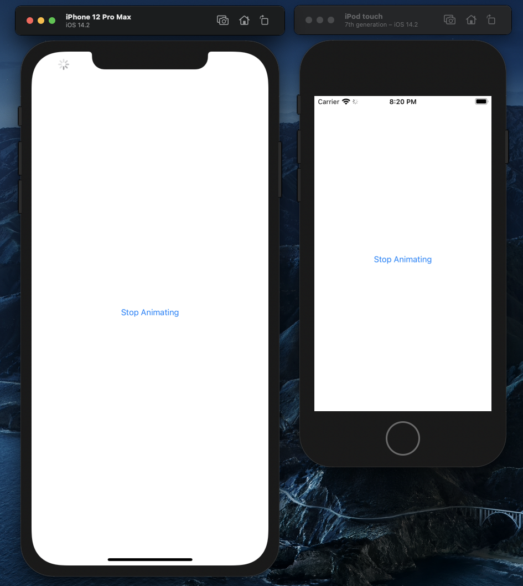

# Network Activity Indicator
This is a simple package that shows network activity indicator, regardless of whether the device has a notch or not



## Why?
> It is a simple way to create an unobstructive, discrete activity indicator when networking. Also, the old one, by Apple, did not work with the notch and got deprecated 😔.


---

## Installation
### Swift Package Manager
```swift
let package = Package(
    name: "MyApp",
    dependencies: [
        .Package(url: "https://github.com/jiachenyee/NetworkActivityIndicator.git", majorVersion: 1)
    ]
)
```

---

## Implementation
### Set-Up
```swift
import NetworkActivityIndicator

// REQURIRED: Add the NetworkActivityIndicatorDelegate protocol
class ViewController: UIViewController, NetworkActivityIndicatorDelegate { 

    // REQUIRED: This variable will be used to update the status bar hidden state
    // You should not edit these four lines 
    var statusBarHidden = false {
        didSet {
            setNeedsStatusBarAppearanceUpdate()
        }
    }
    
    // REQUIRED: Create your network activity indicator
    let networkActivityIndicator = NetworkActivityIndicator()
    
    override func viewDidLoad() {
        super.viewDidLoad()
        // Do any additional setup after loading the view.
        
        // REQUIRED: Assign the delegate
        // Without connecting it to the delegate
        networkActivityIndicator.delegate = self
    }

    // REQUIRED: Set the status bar hidden to connect it to the delegate value
    override var prefersStatusBarHidden: Bool {
        statusBarHidden
    }

    // OPTIONAL: Handle whenever the state of the network activity indicator changes.
    // You can really do whatever you want here
    func networkActivityIndicator(stateChanged isAnimating: Bool) {
        // your code
    }
}
```

### Start/Stop Animating
#### Start
> Start animating the activity indicator
```swift
networkActivityIndicator.start()
```

#### Stop
> Stop animating the activity indicator
```swift
networkActivityIndicator.stop()
```

#### Toggle
> Toggle the network activity indicator. If it is animating, stop, otherwise, start.
```swift
networkActivityIndicator.toggle()
```

#### isAnimating
> Directly update the `isAnimating` variable to make it start and stop
```swift
networkActivityIndicator.isAnimating = true   // start
networkActivityIndicator.isAnimating = false  // stop
networkActivityIndicator.isAnimating.toggle() // toggle
```

---

## Questions / Issues

<details>
<summary><strong>Why is the status bar and network activity indicator overlapping?</strong></summary>

1. Make sure that this is implemented
```swift
var statusBarHidden = false {
    didSet {
        setNeedsStatusBarAppearanceUpdate()
    }
}
```

2. Make sure that you added the `prefersStatusBarHidden` in the view controller
```swift
override var prefersStatusBarHidden: Bool {
    statusBarHidden
}
```
    
</details>

---

## Apache License 2.0

|    Permissions    |   Limitations    | Conditions |
|-------------------|------------------|----------------------------------|
| ✅ Commercial use | ❌ Trademark use | ℹ️ License and copyright notice |
| ✅ Modification   | ❌ Liability     | ℹ️ State changes                |
| ✅ Distribution   | ❌ Warranty      |
| ✅ Patent use     |
| ✅ Private use    |

[Read the license](https://github.com/jiachenyee/NetworkActivityIndicator/blob/main/LICENSE)
